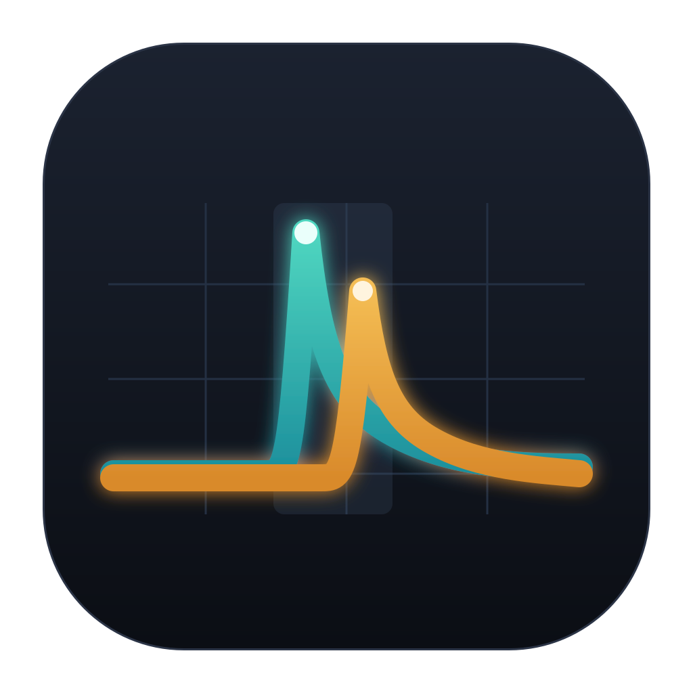
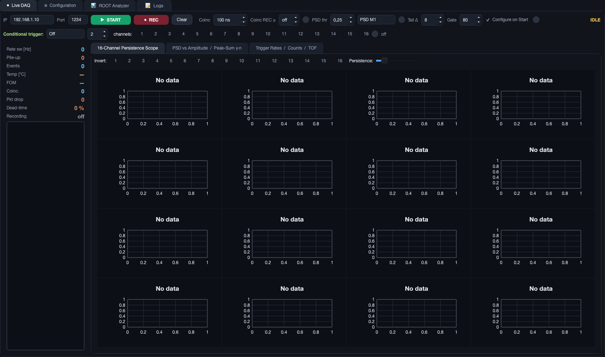
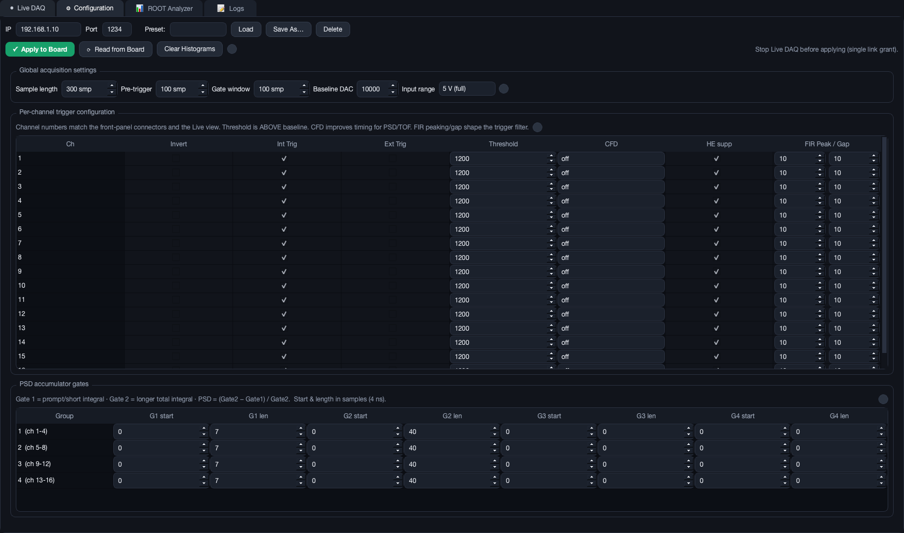
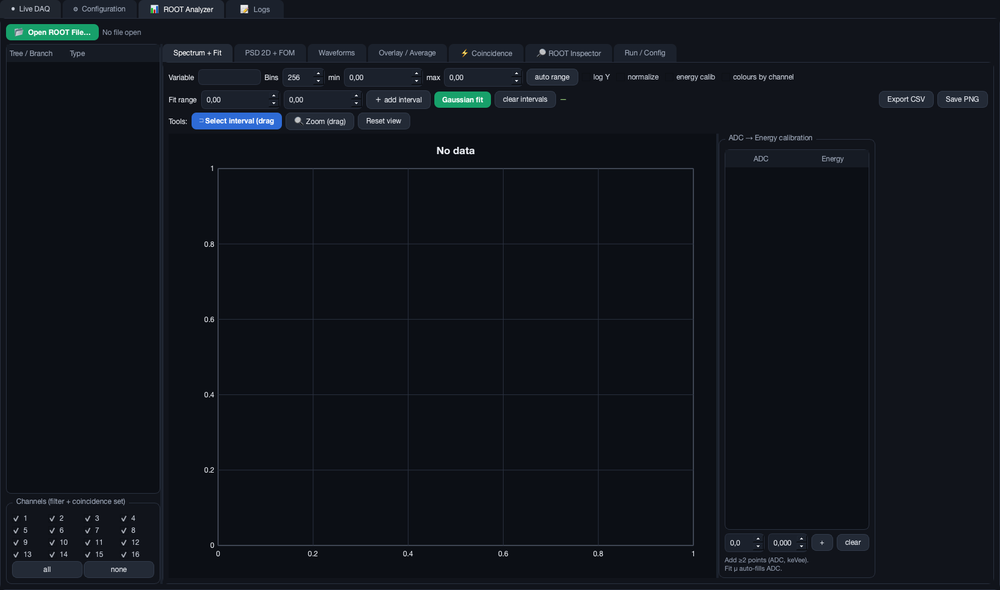

<p align="center">
  
</p>

<h1 align="center">SIS3316 DAQ &amp; Analysis Suite</h1>

<p align="center">
  A modern, self-contained C++17 / Qt6 / ROOT application for the
  <b>Struck SIS3316-250-14</b> (16-channel, 250&nbsp;MS/s, 14-bit) waveform digitizer:
  live acquisition, full hardware configuration, FPGA lookup-table coincidence
  triggering, direct-to-ROOT recording, and native offline analysis &mdash;
  in a single program.
</p>

<p align="center">
  
  
  
  
  
</p>

---

## Contents

- [Highlights](#highlights)
- [Screenshots](#screenshots)
- [Requirements](#requirements)
- [Installation](#installation)
  - [macOS — one-click installer](#macos--one-click-installer)
  - [Manual build (macOS / Linux)](#manual-build-macos--linux)
- [Using the software](#using-the-software)
- [Headless tools](#headless-tools)
- [Tests](#tests)
- [ROOT file schema](#root-file-schema)
- [Project layout](#project-layout)
- [Notes verified against the hardware](#notes-verified-against-the-hardware)
- [Citing](#citing)
- [License](#license)

---

## Highlights

**Live DAQ**
- 16-channel persistence oscilloscope with per-channel invert and adjustable persistence
- PSD-vs-amplitude map, peak-sum γ/n spectra and a live figure-of-merit
- Per-channel trigger-rate bars, on-board statistics counters and coincidence TOF
- Health panel: temperature, UDP packet loss, dead-time
- **Direct-to-ROOT recording** — timestamped files, no intermediate binary formats

**FPGA coincidence trigger** (Trigger Coincidence Lookup Table)
- **AND / OR / multiplicity ≥ N** across any set of channels, enforced in the FPGA
- Uncorrelated singles are dropped at the source → small files, low dead-time
- Verified on a two-detector telescope: member rates collapse to the coincidence
  rate and 100 % of recorded events are time-coincident within the window
- Also available as a software record-filter for runs where all singles must stay live

**Configuration**
- Every important register exposed with inline `(?)` help: per-channel trigger
  enable/invert, threshold, CFD, high-energy suppression, FIR peaking/gap;
  per-group PSD accumulator gates; global sample length, pre-trigger, gate,
  and baseline DAC
- Named JSON presets (Save As / Load / Delete) — nothing is hard-wired to one detector

**ROOT Analyzer** (offline, no ROOT prompt needed)
- Whole file cached in RAM on open → every view redraws instantly, even on
  multi-million-event files
- Spectra of any branch, per-channel colours, **bounded Gaussian fitting** with
  multiple simultaneous intervals reporting μ, σ, FWHM, resolution and event count N
- PSD-2D + automatic n/γ figure-of-merit; waveform navigator with full pulse metrics;
  overlay/average; **coincidence** tab (timestamp clustering, TOF, channel-vs-channel
  matrix, multiplicity, accidental estimate)
- **ROOT Inspector**: browse the whole file and run any ROOT/C++ command in an
  embedded interpreter with inline plot rendering — without leaving the app

---

## Screenshots

| Live DAQ | Configuration |
|---|---|
|  |  |

| ROOT Analyzer |
|---|
|  |

<sub>Shown without a board connected; the live views populate as soon as acquisition starts.</sub>

---

## Requirements

| Dependency | Notes |
|-----------|-------|
| CMake ≥ 3.20 | build system |
| C++17 compiler | clang (macOS) or g++ (Linux) |
| **Qt 6** (Widgets) | GUI framework |
| **CERN ROOT ≥ 6.2x** | data format + analysis backend |

The macOS installer below fetches all of these for you.

---

## Installation

### macOS — one-click installer

On any Mac (Apple Silicon or Intel), from a fresh checkout:

```bash
./install_macos.command
```

or simply **double-click `install_macos.command`** in Finder. It will:

1. install the Xcode command-line tools and [Homebrew](https://brew.sh) if they are missing,
2. `brew install` CMake, Qt 6 and ROOT,
3. build the application, and
4. launch it.

The first run takes a while (ROOT is a large dependency); subsequent runs are fast.
When it finishes, the built app is at `build/SIS3316_Studio.app` — drag it to
`/Applications` if you want it permanently.

### Manual build (macOS / Linux)

```bash
# macOS
brew install cmake qt root
# Debian/Ubuntu: sudo apt install cmake build-essential qt6-base-dev
#                (install ROOT from https://root.cern/install/)

make            # configure + build (Release)
make run        # build, then launch the GUI
```

If CMake cannot find Qt6/ROOT automatically, point it at them:

```bash
make PREFIX_PATH="/path/to/qt6;/path/to/root"
# or:  cmake -S . -B build -DCMAKE_PREFIX_PATH="/path/to/qt6;/path/to/root" && cmake --build build -j8
```

The executable is `build/SIS3316_Studio.app` (macOS) or `build/SIS3316_Studio` (Linux).
Recorded data is written to `Data/` next to this README.

---

## Using the software

The board is reached over UDP at **192.168.1.10:1234** by default (editable in the Live DAQ tab).

**Live DAQ.** Set the IP/port, keep **“Configure on Start”** checked and press **START**.
A freshly powered or reset SIS3316 has all trigger-enable bits, thresholds and window
lengths at zero, so it looks *connected but silent*; with this box checked, START first
writes a complete working configuration and then arms. Press **REC** to stream events to
`Data/YYYY-MM-DD_HH-MM-SS.root`.

**Conditional (coincidence) trigger.** In the Live DAQ “Conditional trigger” row, tick the
**member channels** and choose a **mode** (AND / OR / multiplicity ≥ N), then START. The
board records an event only when the condition holds within the coincidence window,
enforced in the FPGA via the Trigger Coincidence Lookup Table fed back as the internal
trigger. AND on two stacked detectors gives a muon telescope; non-member channels keep
their normal self-trigger.

**Configuration.** Edit any register; save/recall setups as named JSON presets under
`configs/`. Stop Live DAQ before using this tab — the board grants its link to one
interface at a time.

**ROOT Analyzer.** Open any `.root` file produced here and analyze it natively: spectra
with Gaussian fits, PSD-2D + FOM, waveform metrics, coincidence studies, and an embedded
ROOT interpreter (**ROOT Inspector**) for ad-hoc queries.

> **Which quantity to use.** The **software** branches (`qTotalSw`, `psdSw`, `amplitudeSw`)
> are baseline-subtracted and validated, and are the defaults. The raw **FPGA accumulators**
> (`acc1..acc4`, `peakSumFpga`, `psdFpga`) are stored for reference but are
> baseline-dominated on this firmware and are *not* a reliable energy/PSD estimator —
> use the software branches for physics.

---

## Headless tools

Build them with `cmake --build build --target studio_acquire studio_selftest plot_render_test`.

`studio_acquire` — configure, arm and stream to ROOT for a fixed duration, no GUI:

```bash
./build/studio_acquire --seconds 30 --out .                                # → Data/<timestamp>.root
./build/studio_acquire --seconds 60 --hwcoinc-mode and --hwcoinc-ch "1,5"  # hardware AND trigger
```

Options include `--ip`, `--port`, `--seconds`, `--out`, `--threshold`, `--dac`, `--invert`,
`--range`, `--hwcoinc-mode {and,or,mult}`, `--hwcoinc-ch`, `--hwcoinc-min`, and a software
`--coinc-mult` / `--coinc-window` record filter.

---

## Tests

Hardware-free regression tests (parser + PSD + ROOT round-trip, and a headless plot render):

```bash
make selftest
cmake --build build --target plot_render_test && QT_QPA_PLATFORM=offscreen ./build/plot_render_test
```

---

## ROOT file schema

Every file is self-describing and versioned, with three trees:

- **`Events`** — one entry per hit: `channel, det, timestamp, timestampSec, adcMax,
  adcArgmax, acc1..acc4, psdFpga, peakSumFpga, psdSw, qTotalSw, qTailSw, baselineSw,
  amplitudeSw, pileup, nraw, raw[nraw]`
- **`HardwareConfig`** — the full register snapshot at run start
- **`RunSummary`** — `totalEvents, durationSec, rateHz[16], fpgaHit/Gamma/Neutron/Pileup[16],
  avgTempC, deadTimeFrac, udpPacketsDropped`

Storing the register snapshot alongside the data makes each file independently interpretable.

---

## Project layout

```
CMakeLists.txt        top-level build
Makefile              convenience wrapper (make / make run / make selftest)
install_macos.command one-click macOS installer
assets/               application icon + screenshots
configs/              your named JSON presets (created at runtime)
Data/                 recorded ROOT files (created at runtime)
src/
  hw/    Sis3316Daq, Sis3316Registers, Sis3316Config   driver + full board config
  daq/   Event                                         hit/event parser
  analysis/ Analysis                                   PSD, pulse metrics, FOM
  io/    RootWriter                                    ROOT schema (PIMPL)
  gui/   LiveWorker, LiveDaqWidget, ConfigEditor,
         RootAnalyzer, StudioWindow, PlotWidget,
         Heatmap2D, RateBars                           pure Qt6 GUI
  util/  Logger, ConfigStore                           logging, shared config
  tools/ studio_selftest, plot_render_test,            regression tests
         studio_acquire                                headless data-taking
```

---

## Notes verified against the hardware

- The reference board runs 250 MHz firmware **type 0x0250, version 0x40** — the *standard*
  SIS3316 hit format, not the version-0x02 Neutron/Gamma-PSD application firmware. The parser
  targets this standard format and was byte-checked against captured data.
- On this firmware the FPGA accumulators integrate **raw ADC without baseline subtraction**,
  and the FIR trigger asserts after the pulse peak, so the on-board charge-comparison PSD is
  baseline-dominated. All physics therefore defaults to the **software** waveform quantities.
- **Channel mapping:** on this unit the front-panel connectors are wired swapped within each
  pair (connector = ADC readout index ⊕ 1); the software corrects this so the displayed
  channel matches the physical connector. If your unit is wired straight, set
  `swapChannelPairs=false` in `src/gui/LiveWorker.hpp`. **Verify on your own hardware** by
  injecting a pulse into one connector and confirming the displayed channel.

---

## Citing

If this software contributes to your work, please cite it via [`CITATION.cff`](CITATION.cff)
(GitHub shows a “Cite this repository” button) and, once a release is archived on
[Zenodo](https://zenodo.org), the resulting DOI.

---

## License

Released under the **MIT License** — see [`LICENSE`](LICENSE). Qt 6 (LGPLv3) and CERN ROOT
(LGPL-2.1) are *linked*, not redistributed. SIS3316 documentation is © Struck Innovative
Systeme GmbH and is not included here — obtain it from
<https://www.struck.de/sis3316.html>.
